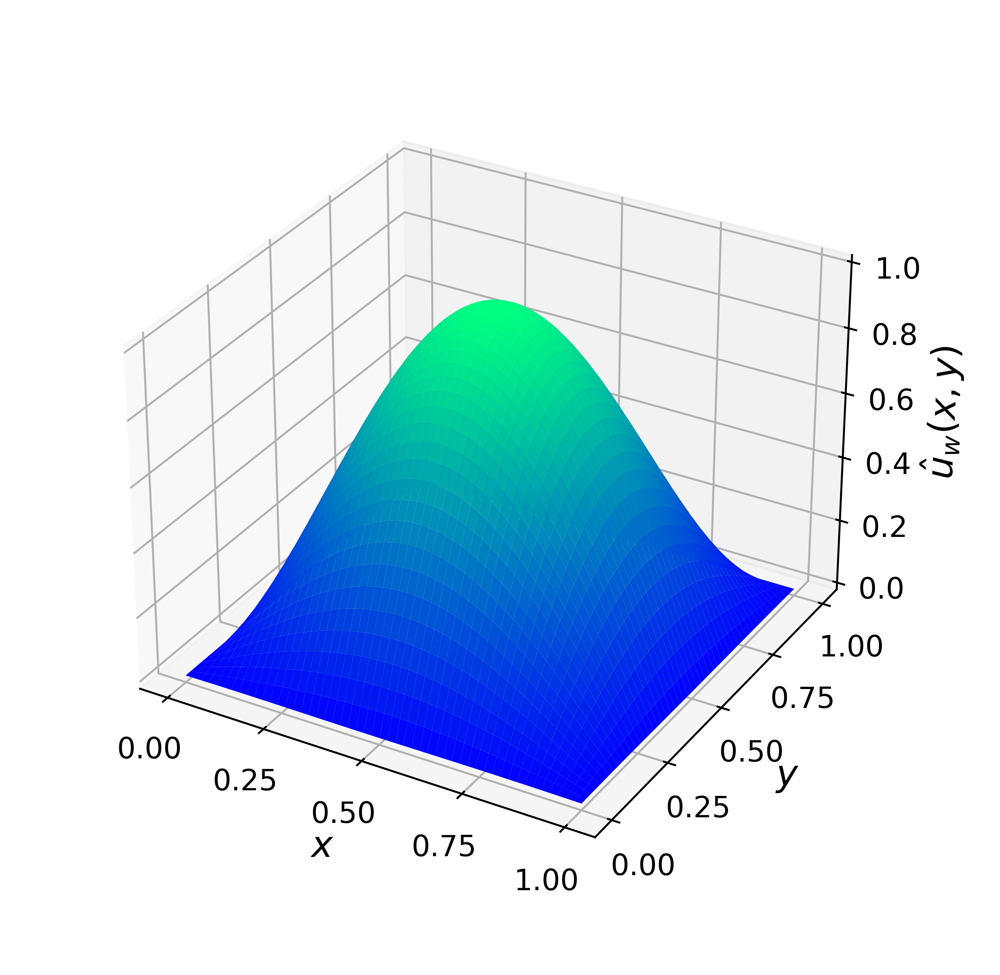
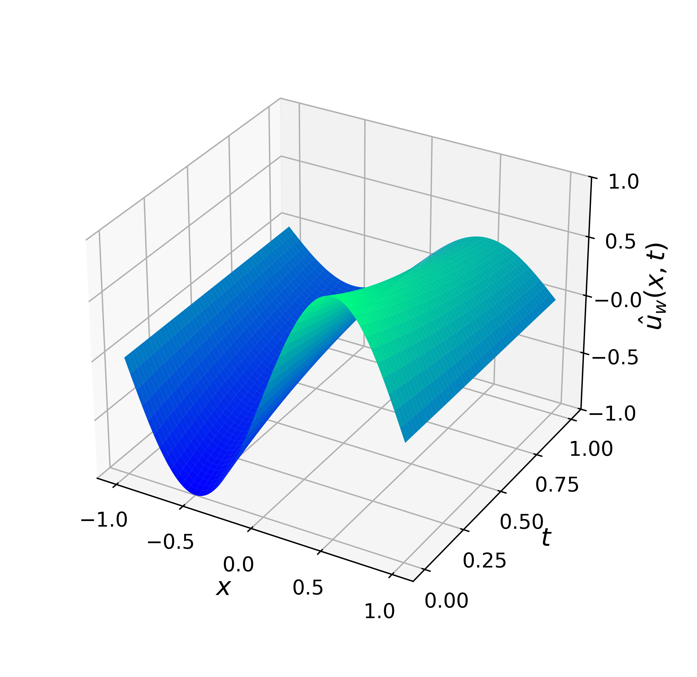
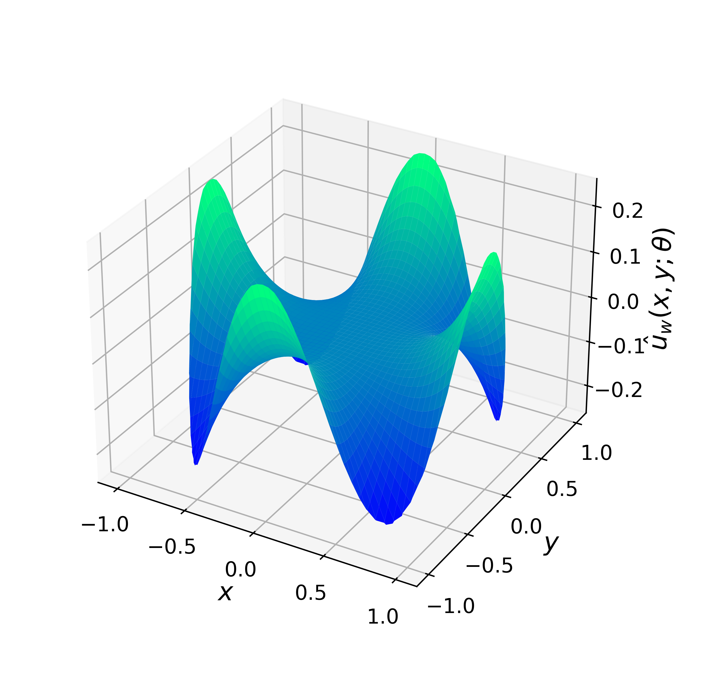
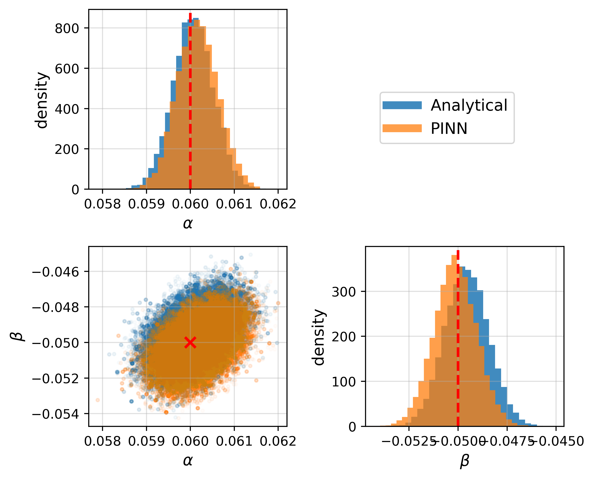

# Physics-Informed Neural Networks Framework (`PinnCore`)

A research-oriented PINN framework for solving PDEs in forward and inverse settings, with built-in Bayesian Uncertainty Quantification.


>**Author:** Ezau Faridh Torres Torres <br>
>**Advisor:** Dr. José Andrés Christen Gracia <br>
>**Institution:** CIMAT – Centro de Investigación en Matemáticas <br>
>**Degree:** M.Sc. in Applied Mathematics <br>
>**Thesis:** *Exploring Physics-Informed Neural Networks in Forward and Inverse PDE Problems* <br>

This repository accompanies my **M.Sc. thesis** and presents a modular framework for Physics-Informed Neural Networks (`PINNs`). It supports the solution of a wide range of forward and inverse PDE problems, with Bayesian Uncertainty Quantification (`BUQ`) via `MCMC`. The code is designed to be extensible, reproducible, and research-oriented, enabling both experimentation and adaptation to new PDE scenarios.

## 📄 Table of Contents
- [Repository Structure](#repository-structure)
- [Core Modules](#core-modules)
- [Forward Problems](#forward-problems)
- [Inverse Problems](#inverse-problems)
- [Inference (MCMC)](#inference-mcmc)
- [Installation & Usage](#installation--usage)
- [Examples](#examples)
- [References](#references)
- [Contact](#contact)

## Repository Structure

```
PinnCore/
├── architectures.py              # Neural network architectures.
├── pinn_core.py                  # Base PINN class.
├── plotting.py                   # Visualization utilities.
├── sampling.py                   # Collocation sampling.
├── trainer.py                    # Training utilities.
├── utils.py                      # Seeds, checkpoint, timers, helpers.
│
├── forward_problems/             # Canonical PDEs in forward configuration 
│   ├── diffusion_nonhomogeneous_MLP/
│   ├── helmholtz_MLP/
│   ├── klein_gordon_MLP/
│   ├── laplace_MLP/
│   ├── poisson_MLP/
│   └── wave_highfreq_MLP/
│
├── inverse_problems/             # Parametric and inverse setups
│   ├── advection_diffusion_parametric_MLP/
│   ├── heat_equation_parametric_MLP/
│   ├── infer_conductivity_support_MLP/
│   └── infer_conductivity_value_MLP/
│
└── inference/                    # Bayesian inference (MCMC with t-walk)
    └── mcmc.py
```

## Core Modules
- **[`architectures.py`](architectures.py)** — Neural network architectures (`MLP`, `CNN`).
- **[`pinn_core.py`](pinn_core.py)** — Base PINN class (loss, autograd).
- **[`plotting.py`](plotting.py)** — Visualization utilities (solutions, losses, analytical comparisons).
- **[`sampling.py`](sampling.py)** — Collocation sampling (interior, boundary, initial conditions).
- **[`trainer.py`](trainer.py)** — Training utilities (`LBFGS`, `Adam`, early stopping).
- **[`utils.py`](utils.py)** — Reproducibility (seeds), checkpoint I/O, timers, helpers.

## Forward Problems
[`forward_problems/`](forward_problems) includes canonical PDEs solved in a forward configuration:

- **Non-homogeneous Diffusion Equation** ([`diffusion_nonhomogeneous_MLP/`](forward_problems/diffusion_nonhomogeneous_MLP/))
- **Helmholtz Equation** ([`helmholtz_MLP/`](forward_problems/helmholtz_MLP/))
- **Klein–Gordon Equation** ([`klein_gordon_MLP/`](forward_problems/klein_gordon_MLP/))
- **Laplace Equation** ([`laplace_MLP/`](forward_problems/laplace_MLP/))
- **Poisson Equation** ([`poisson_MLP/`](forward_problems/poisson_MLP/))
- **Wave Equation (High Frequency)** ([`wave_highfreq_MLP/`](forward_problems/wave_highfreq_MLP/))

## Inverse Problems
[`inverse_problems/`](inverse_problems) contains parameter inference and inverse setups:

- **Advection–Diffusion with parameters $(\alpha, \beta)$** ([`advection_diffusion_parametric_MLP/`](inverse_problems/advection_diffusion_parametric_MLP/))
- **Heat Equation with diffusivity $\alpha$** ([`heat_equation_parametric_MLP/`](inverse_problems/heat_equation_parametric_MLP/))
- **Conductivity inference** (value $\rho$ and support $R$)
  - [`infer_conductivity_support_MLP/`](inverse_problems/infer_conductivity_support_MLP/)
  - [`infer_conductivity_value_MLP/`](inverse_problems/infer_conductivity_value_MLP/)

## Inference (MCMC)
[`inference/`](inference) provides:
- **[`mcmc.py`](inference/mcmc.py)** — Wrapper utilities to run Bayesian inference with PINNs using the `pytwalk` library (`t-walk` sampler).
- Enables posterior sampling from noisy data and comparisons against analytical forward maps.

## Installation & Usage

Clone the repository and install the dependencies:

```bash
git clone https://github.com/ezautorres/Physics-Informed-Neural-Networks-Master-Thesis-CIMAT.git
cd PinnCore
pip install -r requirements.txt
```

Run an example:

```
python forward_problems/poisson_MLP/poisson_MLP.py
```

## Examples

The repository includes ready-to-run examples for both forward and inverse PDE problems.

### Forward Problems
- **Poisson Equation** ([script](forward_problems/poisson_MLP/poisson_MLP.py)) 
  ```bash
  python forward_problems/poisson_MLP/poisson_MLP.py
  ```
   
<div align="center">
  
</div>

- **Non-homogeneous Diffusion Equation** ([script](forward_problems/diffusion_nonhomogeneous_MLP/diffusion_nonhomogeneous_MLP.py)) 
  ```bash
  python forward_problems/diffusion_nonhomogeneous_MLP/diffusion_nonhomogeneous_MLP.py
  ```

<div align="center">
  
</div>

### Inverse Problems
- **Parametric Heat Equation** ([script](inverse_problems/heat_equation_parametric_MLP/heat_equation_parametric_MLP.py))
  ```bash
  python inverse_problems/heat_equation_parametric_MLP/heat_equation_parametric_MLP.py
  ```

<div align="center">
  
</div>

- **Conductivity Inference (Unit Disk)** ([script](inverse_problems/infer_conductivity_support_MLP/infer_conductivity_support_MLP.py))
  ```bash
  python inverse_problems/infer_conductivity_support_MLP/infer_conductivity_support_MLP.py
  ```

<div align="center">
  
</div>

### Two-parameter Inference
- **Parametric Advection-Diffusion Equation** ([script](inverse_problems/advection_diffusion_parametric_MLP/advection_diffusion_mcmc.py))
  ```bash
  python inverse_problems/advection_diffusion_parametric_MLP/advection_diffusion_mcmc.py
  ```

<div align="center">
  
</div>

## References

- Raissi, M., Perdikaris, P., & Karniadakis, G.E. (2019). *Physics-informed neural networks: A deep learning framework for solving forward and inverse problems involving nonlinear partial differential equations*. **Journal of Computational Physics**, 378, 686–707. [doi:10.1016/j.jcp.2018.10.045](https://doi.org/10.1016/j.jcp.2018.10.045)

- Karniadakis, G.E., Kevrekidis, I.G., Lu, L., Perdikaris, P., Wang, S., & Yang, L. (2021). *Physics-informed machine learning*. **Nature Reviews Physics**, 3(6), 422–440. [doi:10.1038/s42254-021-00314-5](https://doi.org/10.1038/s42254-021-00314-5)

- Cuomo, S., Schiano Di Cola, V., Giampaolo, F., Rozza, G., Raissi, M., & Piccialli, F. (2022). *Scientific Machine Learning through Physics-Informed Neural Networks: Where we are and What's next*. **arXiv preprint** [arXiv:2201.05624](https://arxiv.org/abs/2201.05624)

- Lagaris, I.E., Likas, A., & Fotiadis, D.I. (1998). *Artificial neural networks for solving ordinary and partial differential equations*. **IEEE Transactions on Neural Networks**, 9(5), 987–1000. [doi:10.1109/72.712178](http://dx.doi.org/10.1109/72.712178)

- Christen, J.A. & Fox, C. (2010). *A general purpose sampling algorithm for continuous distributions (the t-walk)*. **Bayesian Analysis**, 5(2), 263–281. [doi:10.1214/10-BA603](https://doi.org/10.1214/10-BA603)

## Contact

- 📫 **Author:** Ezau Faridh Torres Torres  
- 📧 **Email:** ezau.torres@cimat.mx  
- 💼 **LinkedIn:** [linkedin.com/in/ezautorres](https://linkedin.com/in/ezautorres)
- 💻 **GitHub:** [github.com/ezautorres](https://github.com/ezautorres)