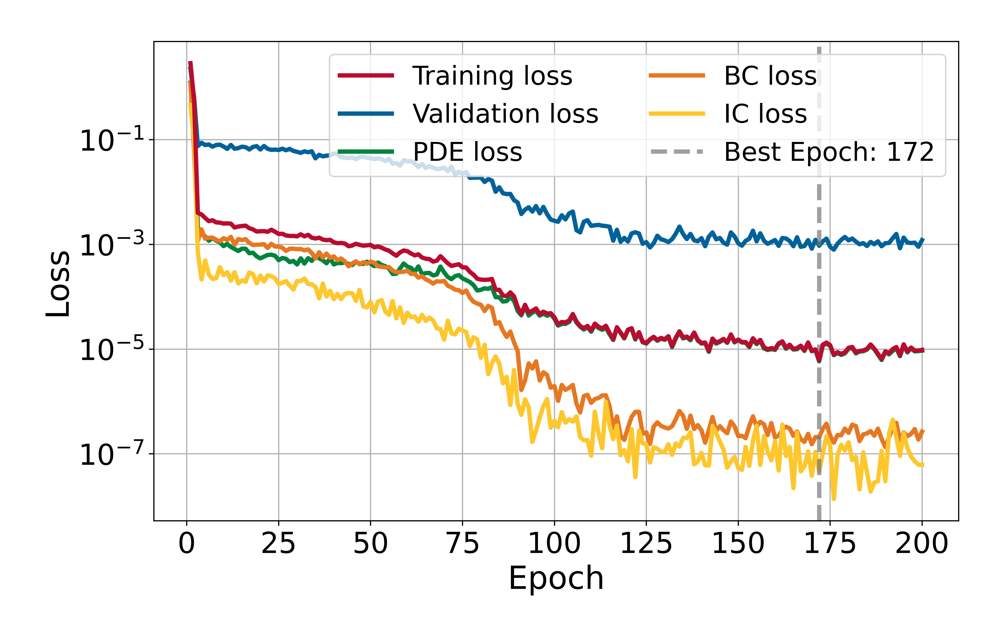
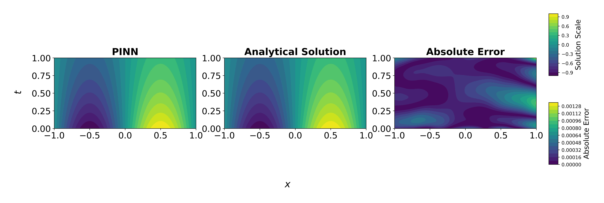

# 1D Nonhomogeneous Diffusion Equation

This experiment solves the 1D time-dependent diffusion equation on the space–time domain $\Omega \times (0,T=1]$ with $\Omega:= [-1,1]$ using a Physics-Informed Neural Network (PINN). It shows how a PINN learns a nonhomogeneous PDE from physics (PDE + IC/BC) without labeled data.

## Problem Description

The following PDE is solved:

$$
\frac{\partial \boldsymbol{u}}{\partial t} - \frac{\partial \boldsymbol{u}^2}{\partial x^2} = -e^{-t}\sin(\pi x) (1-\pi^{2}), \qquad x\in\Omega, \quad t\in(0,1],
$$

with homogeneous Dirichlet boundary conditions:

$$
\boldsymbol{u}(-1,t) = \boldsymbol{u}(1,t) = 0, \qquad t \in [0,1].
$$

Initial condition:

$$
\boldsymbol{u}(x,0) = \sin(\pi x), \qquad x\in\overline{\Omega}.
$$

The analytical solution is:

$$
\boldsymbol{u}(x,t) = e^{-t}\sin(\pi x).
$$
        
## Model Summary

| Component    | Choice                                                              |
|--------------|---------------------------------------------------------------------|
| Network      | MLP with hidden layers [50, 200, 100]                               |
| Optimizer    | L-BFGS (strong Wolfe line search)                                   |
| Activation   | Tanh (with LayerNorm after each Linear)                             |
| Dropout      | 0.00                                                                |
| Domain       | $x\in\Omega=[-1,1],\ t\in[0,1]$                                     |
| Collocation  | 200 interior; 200 boundary (100 @ $x=-1$, 100 @ $x=1$); 100 initial |
| Loss         | PDE residual + boundary condition loss + initial condition loss     |
| Weights used | $\lambda_{pde} = \lambda_{bc} = \lambda_{ic} =  1.0$                | 
| Error        | $6.1\times10^{-6}$ @ epoch 172                                      |
| Time         | 5125.82 s                                                           |

## Training Losses

  

## Solution Predicted by the PINN

  

## Comparison with Analytical Solution

  

---

*Author: Ezau Faridh Torres Torres · CIMAT · Aug 2025*