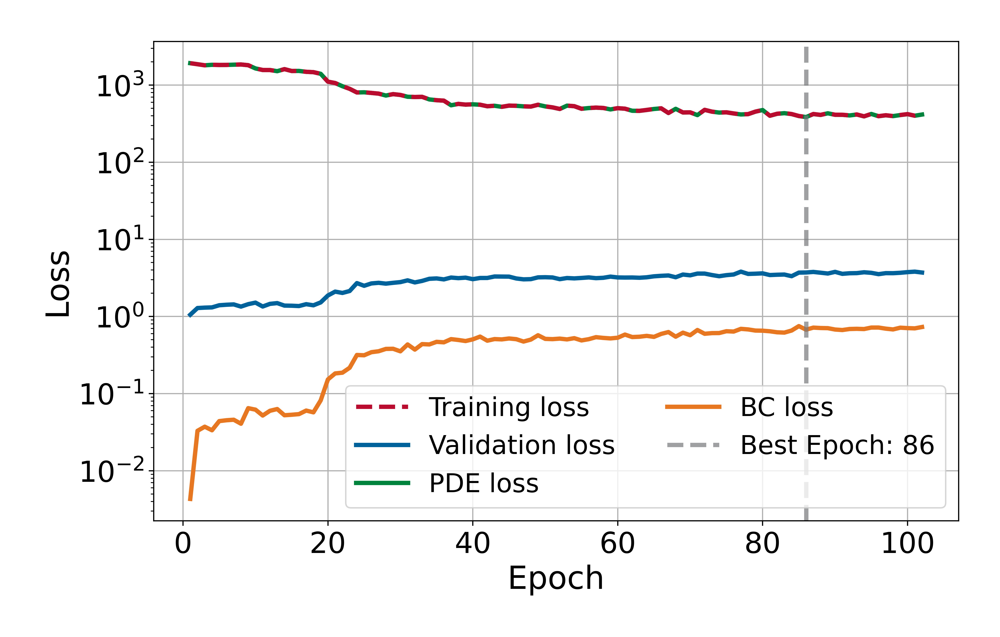
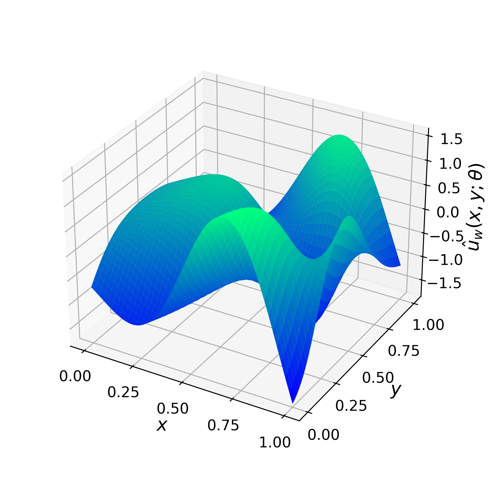
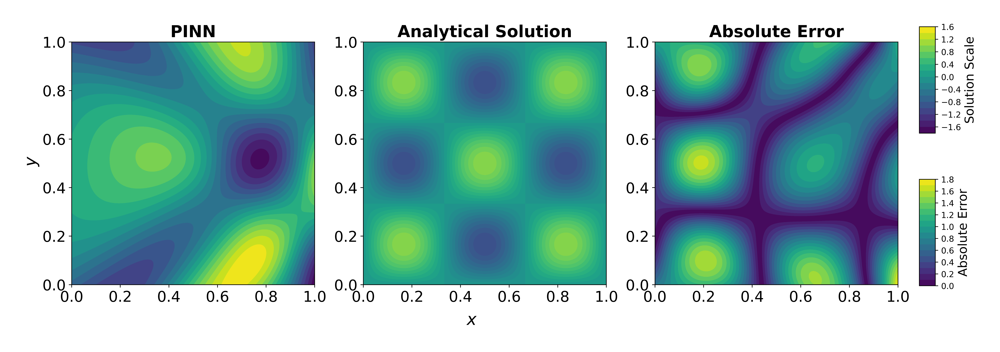

# Nonhomogeneous Helmholtz Equation in 2D

This experiment solves the 2D Nonhomogeneous Helmholtz equation on the unit square $\Omega:=[0,1]\times[0,1]$ using a Physics-Informed Neural Network. This experiment exemplifies a case where Physics-Informed Neural Networks (PINNs) can fail with a simple case spatial oscillations damped by a reaction term $−k^2\boldsymbol{u}$, particularly for high wavenumbers $k$.

## Problem Description

The following PDE is solved:

$$
-\Delta \boldsymbol{u}(x,y) - k^2 \boldsymbol{u} (x,y) = k^2 \sin(k x)\sin(k y), \qquad (x,y)\in\Omega,
$$

with homogeneous Dirichlet boundary conditions:

$$
\boldsymbol{u}(x,y)= 0, \qquad (x,y)\in\partial\Omega.
$$

When $k=n\pi$ with $n\in\mathbb{Z}^{+}$, the analytical solution is:

$$
\boldsymbol{u}(x,y) = \sin(k x) \sin(k y).
$$
        
## Model Summary for $k=3\pi$

| Component    | Choice                                       |
|--------------|----------------------------------------------|
| Network      | MLP with 4 hidden layers: [100, 120, 75, 50] |
| Optimizer    | L-BFGS (strong Wolfe line search)            |
| Activation   | Tanh (with LayerNorm after each Linear)      |
| Dropout      | 0.01                                         |
| Domain       | Unit square $\Omega=[0,1]\times[0,1]$        |
| Collocation  | 1200 interior, 1600 boundary @ 400 each      |
| Loss         | PDE residual + boundary condition loss       |
| Weights used | $\lambda_{pde} = \lambda_{bc} = 1.0$         | 
| Error        | $3.85\times 10^{2}$ @ epoch 86               |
| Time         | 24985.46 s                                   |

## Training Losses

  

## Solution Predicted by the PINN

  

## Comparison with Analytical Solution

  

---

*Author: Ezau Faridh Torres Torres · CIMAT · Aug 2025*