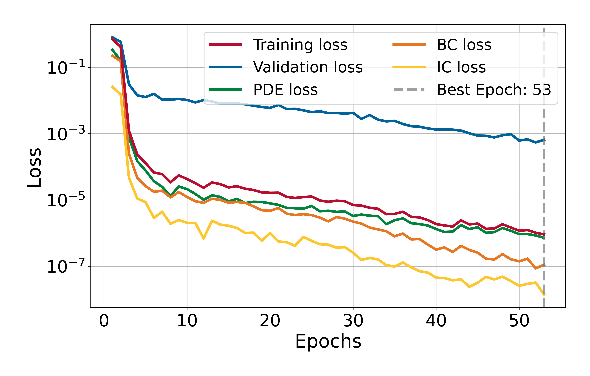
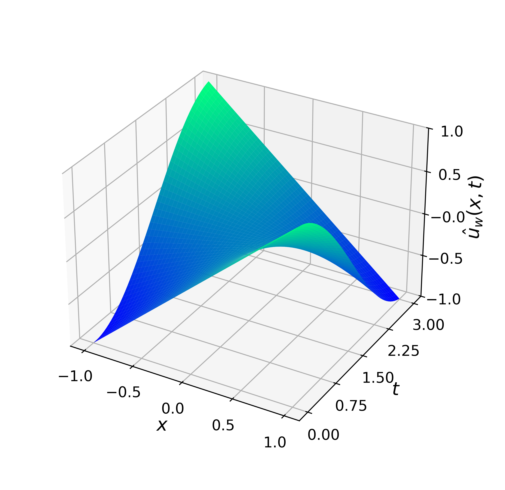
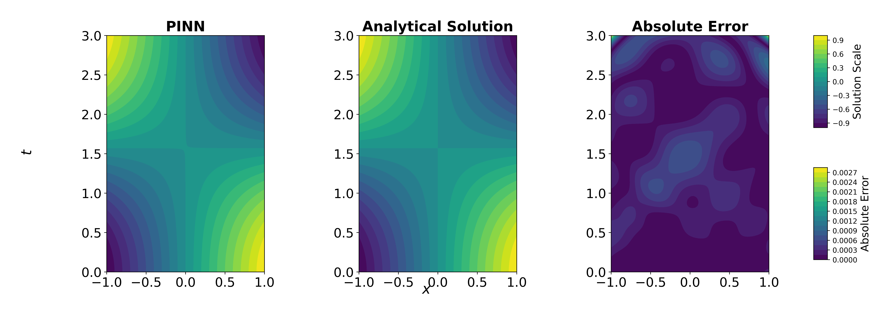

# 1D Nonlinear Klein-Gordon Equation

This experiment solves the nonlinear Klein-Gordon equation on the space-time domain 
$\Omega\times[0,3]$ with $\Omega:=[-1,1]$ using a Physics-Informed Neural Network (PINN) with Dirichlet boundary conditions and initial conditions. This experiment demonstrates how a Physics-Informed Neural Network (PINN) can solve equation, showcasing its ability to approximate PDE solutions without labeled data.

## Problem Description

The following PDE is solved:

$$
\frac{\partial \boldsymbol{u}^2}{\partial t^2} + \alpha \frac{\partial \boldsymbol{u}^2}{\partial x^2} + \beta \boldsymbol{u} + \gamma \boldsymbol{u}^{k} = -x\cos{t} + x^{2}\cos^{2}{t}, \qquad x\in\Omega, \quad t\in(0,3],
$$

with parameters $\alpha=-1$, $\beta=0$, $\gamma=1$, $k=2$, and homogeneous Dirichlet boundary conditions:

$$
    \boldsymbol{u}(-1,t) = -\cos{t}, \quad \boldsymbol{u}(1,t) = \cos{t}, \qquad t\in[0,3].
$$

Initial condition:

$$
    \boldsymbol{u}(x,0) = x, \quad \frac{\partial \boldsymbol{u}}{\partial t}(x,0) = 0, \qquad x\in\overline{\Omega}.
$$

The analytical solution is:

$$
\boldsymbol{u}(x,t) = x\cdot \cos{t}.
$$
        
## Model Summary

| Component    | Choice                                                              |
|--------------|---------------------------------------------------------------------|
| Network      | MLP with hidden layers [75, 75, 75, 75]                             |
| Optimizer    | L-BFGS (strong Wolfe line search)                                   |
| Activation   | Swish (with LayerNorm after each Linear)                            |
| Dropout      | 0.00                                                                |
| Domain       | $x\in\Omega=[-1,1],\ t\in[0,3]$                                     |
| Collocation  | 230 interior; 200 boundary (100 @ $x=-1$, 100 @ $x=1$); 100 initial |
| Loss         | PDE residual + boundary condition loss + initial condition loss     |
| Weights used | $\lambda_{pde} = 1.0$, $\lambda_{bc} = \lambda_{ic} = 1.5$          | 
| Error        | $9.1\times10^{-7}$ @ epoch 53                                       |
| Time         | 4583.53 s                                                           |

## Training Losses

  

## Solution Predicted by the PINN

  

## Comparison with Analytical Solution

  

---

*Author: Ezau Faridh Torres Torres · CIMAT · Aug 2025*