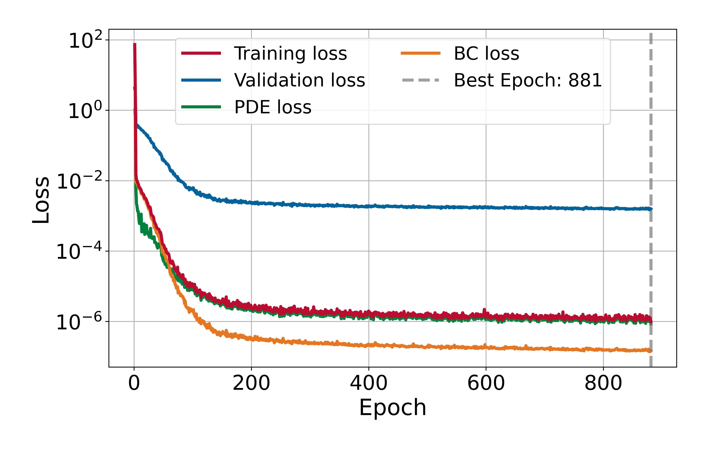
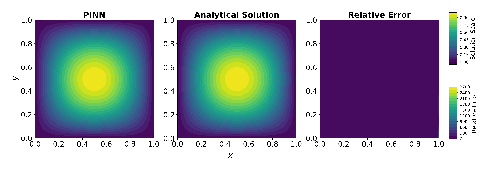

# Poisson Equation

This experiment solves the 2D Poisson equation on the unit square $[0,1]\times[0,1]$ using a Physics-Informed Neural Network. This experiment demonstrates how a Physics-Informed Neural Network (PINN) can solve the 2D Poisson equation, showcasing its ability to approximate PDE solutions without labeled data.

## Problem Description

The following PDE is solved:

$$
\Delta \boldsymbol{u}(x,y) = -2\pi^2 \sin(\pi x)\sin(\pi y),
$$

with homogeneous Dirichlet boundary conditions:

$$
\boldsymbol{u}(x,0) = \boldsymbol{u}(x,1) = \boldsymbol{u}(0,y) = \boldsymbol{u}(1,y) = 0.
$$

The analytical solution is:

$$
\boldsymbol{u}(x,y) = \sin(\pi x) \cdot \sin(\pi y).
$$
        
## Model Summary

| Component   | Choice                                  |
|-------------|-----------------------------------------|
| Network     | MLP with 3 hidden layers (100 neurons)  |
| Optimizer   | L-BFGS (strong Wolfe line search)       |
| Activation  | Tanh (with LayerNorm after each Linear) |
| Dropout     | 0.01                                    |
| Domain      | Unit square $[0,1]\times[0,1]$          |
| Collocation | 500 interior, 8000 boundary points      |
| Loss        | PDE residual + boundary condition loss  |
| Error       | $4.33\times10^{-6}$ @ epoch 101         |

## Training Losses

  

## Solution Predicted by the PINN

  

## Comparison with Analytical Solution

  

---

*Author: Ezau Faridh Torres Torres · CIMAT · Aug 2025*