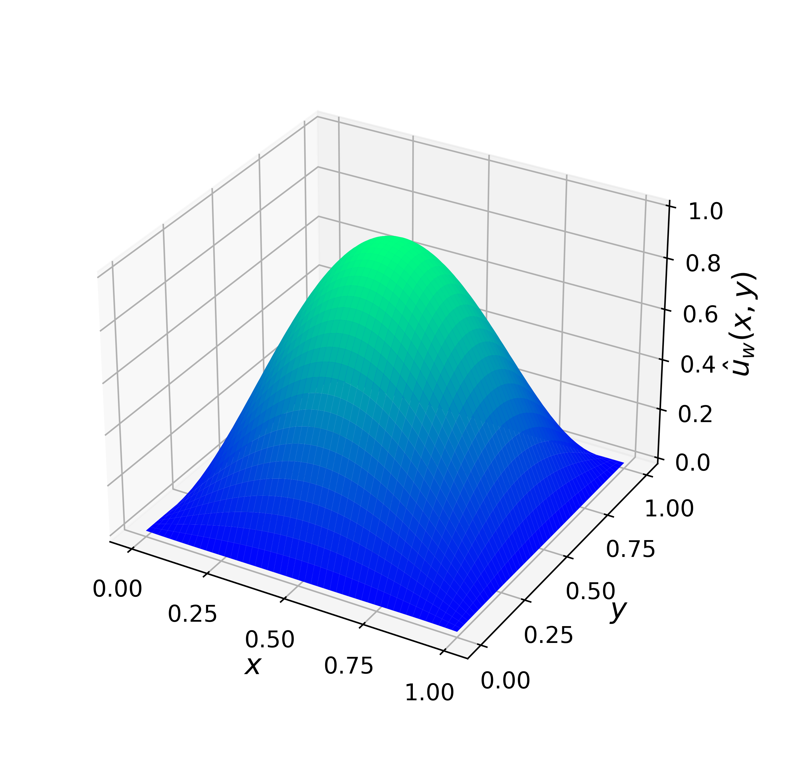

# Poisson Equation

This experiment solves the 2D Poisson equation on the unit square \[0,1\]×\[0,1\] using a Physics-Informed Neural Network.

## Problem Description

The following PDE is solved:

              Δu(x,y) = -2π²sin(πx)sin(πy),

with homogeneous Dirichlet boundary conditions:

              u(x,0) = u(x,1) = u(0,y) = u(1,y) = 0.

The analytical solution is:

              u(x,y) = sin(πx)sin(πy).
        
---

## Model Summary

- Neural network: MLP with 3 hidden layers of 100 neurons each.
- Optimizer: L-BFGS with strong Wolfe line search.
- Domain: unit square \[0,1\]×\[0,1\]
- Collocation points: 500 interior, 8000 on the boundary.
- Loss: PDE residual + boundary condition loss.

---

## Training Losses

  

---

## Solution Predicted by the PINN

  

---

## Comparison with Analytical Solution

  

---

*Author: Ezau Faridh Torres Torres · CIMAT · Jun 2025*