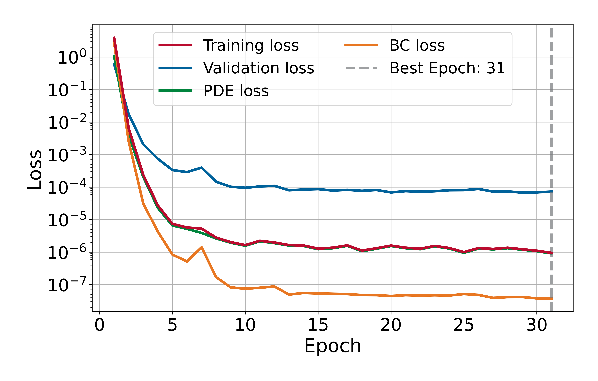
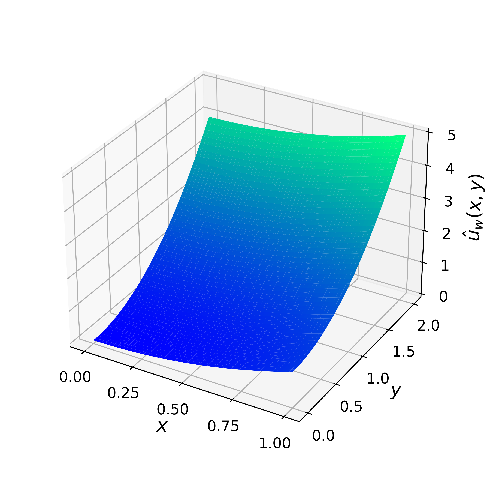
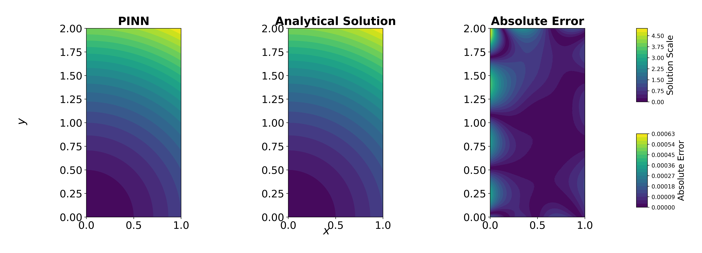

# Poisson Equation – Constant Source Term 

This experiment solves the 2D Poisson equation with constant source term on $\Omega:=[0,1]\times[0, 2]$ using a Physics-Informed Neural Network. This experiment demonstrates how a Physics-Informed Neural Network (PINN) can solve the 2D Poisson equation, showcasing its ability to approximate PDE solutions without labeled data.

## Problem Description

The following PDE is solved:

$$
\Delta \boldsymbol{u}(x,y) = 4, \qquad (x,y)\in\Omega,
$$

with boundary conditions:

$$
\boldsymbol{u}(0,y) = y^2, \quad
\boldsymbol{u}(1,y) = 1 + y^2, \quad
\boldsymbol{u}(x,0) = x^2, \quad
\boldsymbol{u}(x,2) = 4 + x^2.
$$

The analytical solution is:

$$
\boldsymbol{u}(x,y) = x^2 + y^2.
$$
        
## Model Summary

| Component    | Choice                                                |
|--------------|-------------------------------------------------------|
| Network      | MLP with hidden layers [100, 50, 50]                  |
| Optimizer    | L-BFGS (strong Wolfe line search)                     |
| Activation   | Tanh (with LayerNorm after each Linear)               |
| Dropout      | 1e-8                                                  |
| Domain       | $\Omega=[0,1]\times[0,2]$                             |
| Collocation  | 200 interior, 1000 boundary points (@ 250 each side)  |
| Loss         | PDE residual + boundary condition loss                |
| Weights used | $\lambda_{pde} = \lambda_{bc} = 1.0$                  | 
| Error        | $9.6\times10^{-7}$ @ epoch 31                         |
| Time         | 1260.67 s                                             |

## Training Losses

  

## Solution Predicted by the PINN

  

## Comparison with Analytical Solution

  

---

*Author: Ezau Faridh Torres Torres · CIMAT · Aug 2025*