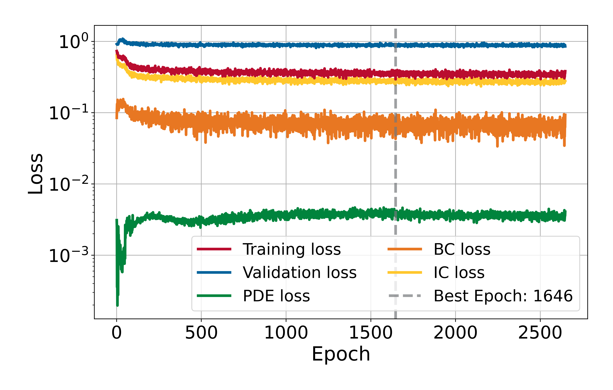
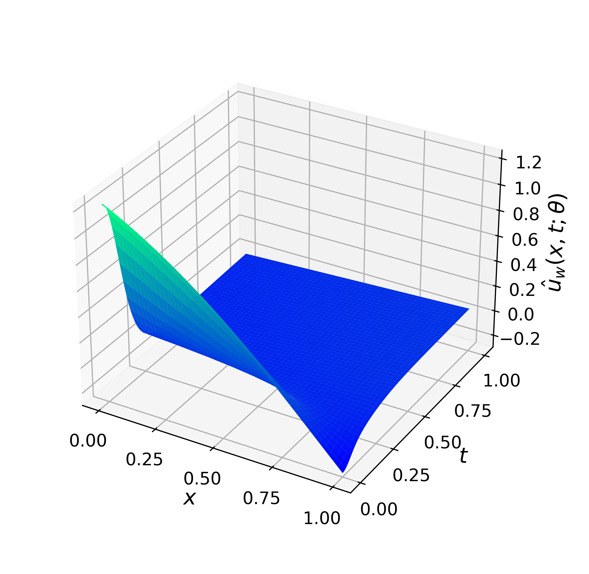
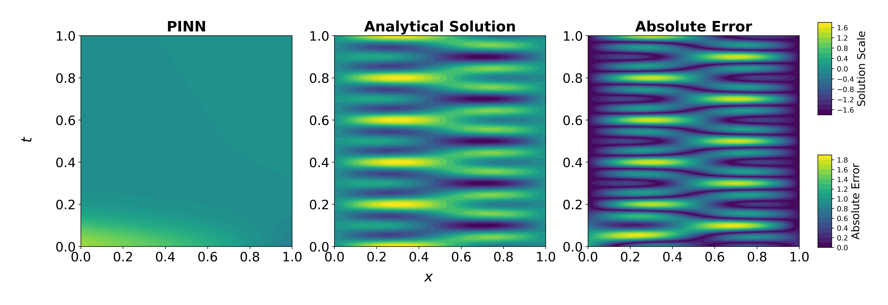

# 1D Wave Equation

This experiment solves the 1D Wave Equation on the space-time domain 
$\Omega\times[0,1]$ with $\Omega:=[0,1]$ using a Physics-Informed Neural Network (PINN) with Dirichlet boundary conditions and initial conditions. This experiment demonstrates how a Physics-Informed Neural Network (PINN) can easily fail damped by a high wave speed $c$.

## Problem Description

The following PDE is solved:

$$
\frac{\partial \boldsymbol{u}^2}{\partial t^2} - c^2 \frac{\partial \boldsymbol{u}^2}{\partial x^2} = 0, \qquad x\in\Omega, \quad t\in(0,1],
$$

and homogeneous Dirichlet boundary conditions:

$$
    \boldsymbol{u}(0,t) = \boldsymbol{u}(1,t) = 0, \qquad t\in[0,1].
$$

Initial condition:

$$
    \boldsymbol{u}(x,0) = \sin(\pi x) + \sin(2 \pi x), \quad \frac{\partial \boldsymbol{u}}{\partial t}(x,0) = 0, \qquad x\in\overline{\Omega}.
$$

The analytical solution is:

$$
\boldsymbol{u}(x,t) = \sin(\pi x)\cdot\cos(\pi c t) + \sin(2\pi x)\cdot\cos(2\pi c t).
$$
        
## Model Summary for $c=10$

| Component    | Choice                                                              |
|--------------|---------------------------------------------------------------------|
| Network      | MLP with 6 hidden layers of 100 neurons                             |
| Optimizer    | L-BFGS (strong Wolfe line search)                                   |
| Activation   | Swish (with LayerNorm after each Linear)                            |
| Dropout      | 0.001                                                               |
| Domain       | $x\in\Omega=[0,1],\ t\in[0,1]$                                      |
| Collocation  | 1500 interior; 400 boundary (200 @ $x=0$, 200 @ $x=1$); 500 initial |
| Loss         | PDE residual + boundary condition loss + initial condition loss     |
| Weights used | $\lambda_{pde} = 2.0$, $\lambda_{bc} = \lambda_{ic} = 1.0$          | 
| Error        | $2.94\times10^{-1}$ @ epoch 1646                                    |
| Time         | 3419.14 s                                                           |

## Training Losses

  

## Solution Predicted by the PINN

  

## Comparison with Analytical Solution

  

---

*Author: Ezau Faridh Torres Torres · CIMAT · Aug 2025*