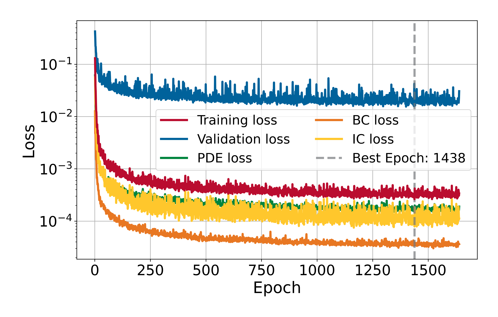
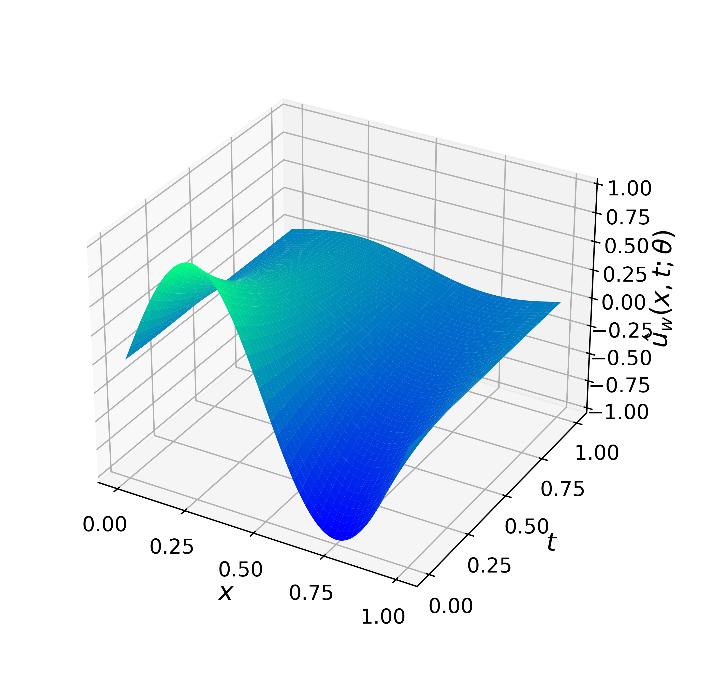
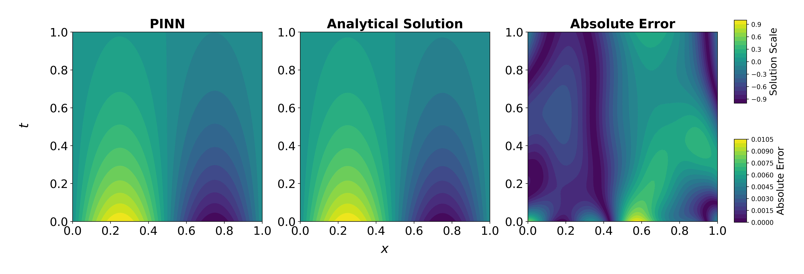
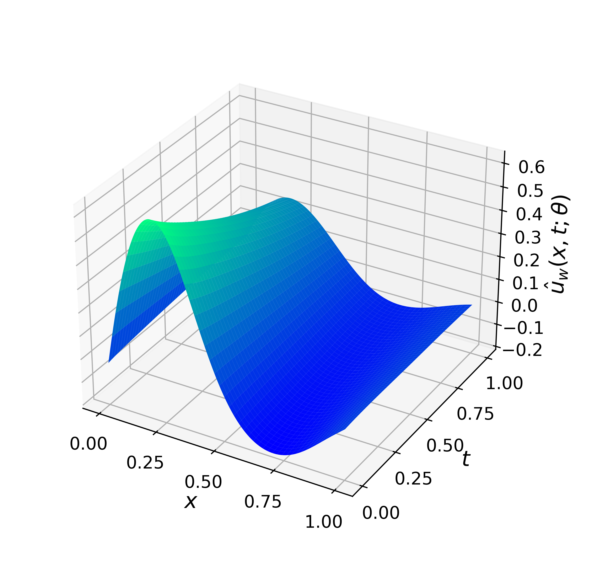
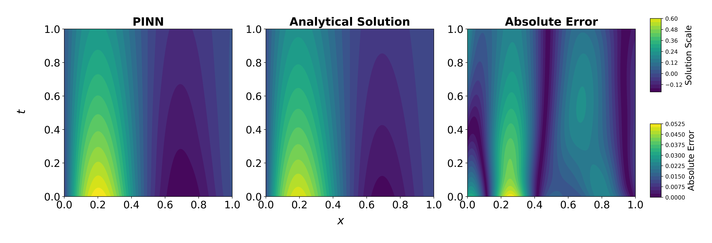

# 1D Advection-Diffusion Equation

This experiment addresses the one-dimensional Advection-Diffusion Equation on the space–time domain $\Omega \times [0,T]$, with $\Omega = [0,L]$. The problem is solved using a Physics-Informed Neural Network (PINN) subject to Dirichlet boundary conditions and an initial condition. The study illustrates how a PINN can be extended to a parametric formulation, enabling the model to learn solutions across a range of admissible values of the termal diffusivity parameter $\alpha$ and advection coefficient $\beta$, which is then evaluated for selected test cases.

## Problem Description

The following PDE is solved:

$$
\frac{\partial \boldsymbol{u}}{\partial t} - \alpha \frac{\partial \boldsymbol{u}^2}{\partial x^2} + \beta \frac{\partial \boldsymbol{u}}{\partial x} = 0, \qquad x\in\Omega, \quad t\in(0,T],
$$

and homogeneous Dirichlet boundary conditions:

$$
    \boldsymbol{u}(0,t) = \boldsymbol{u}(L,t) = 0, \qquad t\in[0,T].
$$

Initial condition:

$$
    \boldsymbol{u}(x,0) = \sin\left(\frac{n \pi x}{L}\right) \cdot \exp\left(\frac{\beta x}{2\alpha}\right), \qquad x\in\overline{\Omega}, n\in\mathbb{N}
$$

The analytical solution is:

$$
\boldsymbol{u}(x,t) = \sin\left(\frac{n \pi x}{L}\right) \cdot \exp\left(\frac{\beta x}{2\alpha}\right) \cdot \exp\left(- \left\[\alpha\left(\frac{n\pi}{L}\right)^2 + \frac{\beta^2}{4\alpha} \right\] t \right).
$$
        
## Model Summary for $\alpha\in[0.02, 0.12],\ \beta\in[-0.15, 0.1],\ n=2,\ L=T=1$

| Component    | Choice                                                                   |
|--------------|--------------------------------------------------------------------------|
| Network      | MLP with 2 hidden layers: [100,50]                                       |
| Optimizer    | L-BFGS (strong Wolfe line search)                                        |
| Activation   | tanh (with LayerNorm after each Linear)                                  |
| Dropout      | 0.0                                                                      |
| Domain       | $x\in\Omega=[0,1],\ t\in[0,1]$                                           |
| Collocation  | 10000 interior; 8000 boundary (4000 @ $x=0$, 4000 @ $x=L$); 4000 initial |
| Loss         | PDE residual + boundary condition loss + initial condition loss          |
| Weights used | $\lambda_{pde} = \lambda_{bc} = \lambda_{ic} = 1.0$                      | 
| Error        | $2.62\times10^{-4}$ @ epoch 1438                                         |
| Time         | 7037.38 s                                                                |

### Training Losses

  

### Solution Predicted by the PINN for $\alpha = 0.06$ and $\beta = 0$

  

#### Comparison with Analytical Solution

  

### Solution Predicted by the PINN for $\alpha = 0.021$ and $\beta = -0.1$

  

#### Comparison with Analytical Solution

  

## Bayesian Inference (MCMC) for $\alpha = 0.06$

| Metric                   | PINN                   | Analytical Solution    |
|--------------------------|------------------------|------------------------|
| **Mean**                 | `0.060179`             | `0.060073`             |
| **Median**               | `0.060175`             | `0.060069`             |
| **Mode**                 | `0.059581`             | `0.060916`             |
| **Std**                  | `0.000470`             | `0.000464`             |
| **Conf. Interval (95%)** | `[0.059268, 0.061106]` | `[0.059166, 0.060979]` |
| **16th Percentile**      | `0.059712`             | `0.059615`             |
| **84th Percentile**      | `0.060649`             | `0.060540`             |
| **Execution time**       | `124.03 s`             | `93.74 s`              |

## Bayesian Inference (MCMC) for $\beta = -0.05$

| Metric                   | PINN                     | Analytical Solution      |
|--------------------------|--------------------------|--------------------------|
| **Mean**                 | `-0.050132`              | `-0.049542`              |
| **Median**               | `-0.050141`              | `-0.049544`              |
| **Mode**                 | `-0.051108`              | `-0.047868`              |
| **Std**                  | `0.001085`               | `0.001115`               |
| **Conf. Interval (95%)** | `[-0.052276, -0.048004]` | `[-0.051729, -0.047355]` |
| **16th Percentile**      | `-0.051200`              | `-0.050654`              |
| **84th Percentile**      | `-0.049041`              | `-0.048433`              |
| **Execution time**       | `124.03 s`               | `93.74 s`                |

### Corner Comparison

  

---

*Author: Ezau Faridh Torres Torres · CIMAT · Aug 2025*