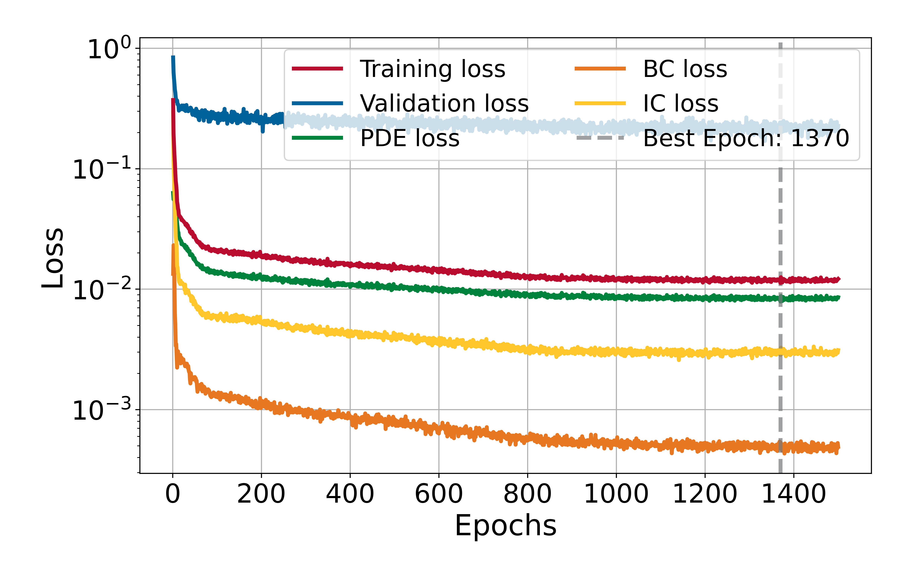
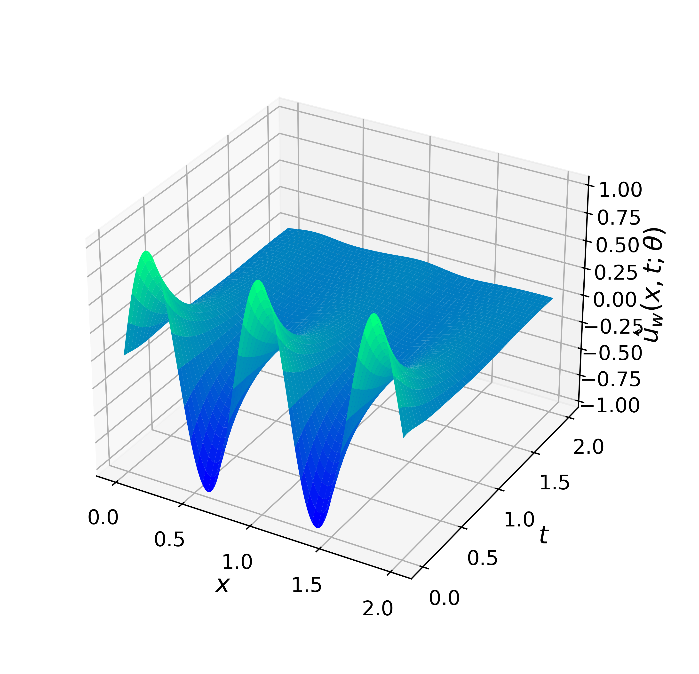
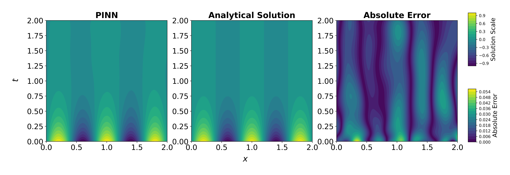
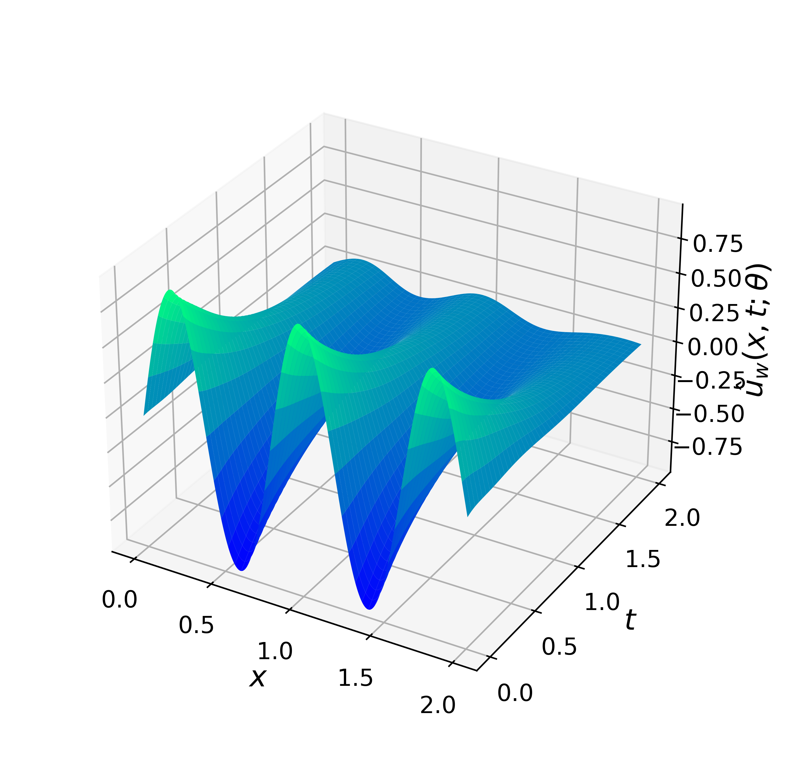
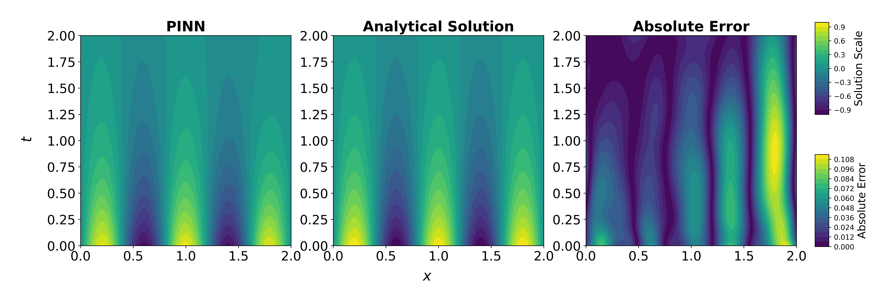
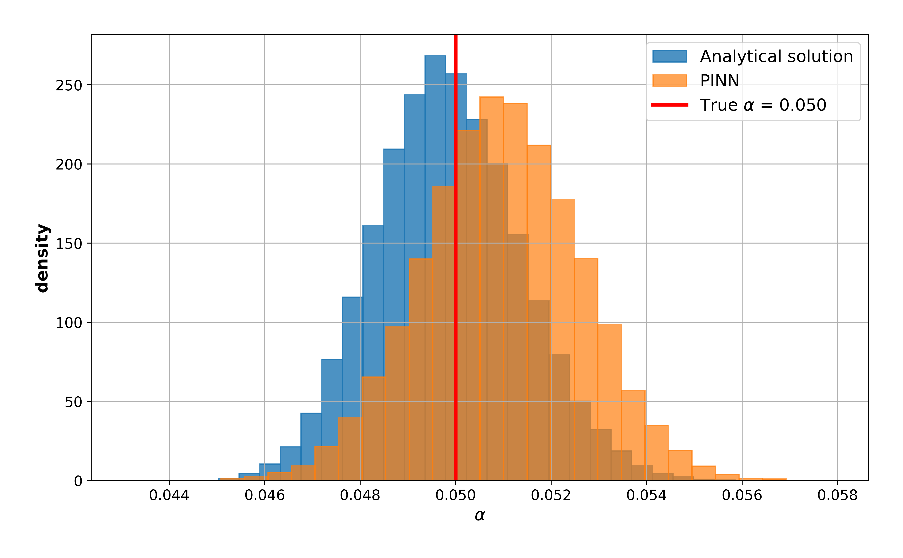

# 1D Heat Equation

This experiment addresses the one-dimensional Heat Equation on the space–time domain
$\Omega \times [0,T]$, with $\Omega = [0,L]$. The problem is solved using a Physics-Informed Neural Network (PINN) subject to Dirichlet boundary conditions and an initial condition. The study illustrates how a PINN can be extended to a parametric formulation, enabling the model to learn solutions across a range of admissible values of the termal diffusivity parameter $\alpha$, which is then evaluated for selected test cases.

## Problem Description

The following PDE is solved:

$$
\frac{\partial \boldsymbol{u}}{\partial t} - \alpha \frac{\partial \boldsymbol{u}^2}{\partial x^2} = 0, \qquad x\in\Omega, \quad t\in(0,T],
$$

and homogeneous Dirichlet boundary conditions:

$$
    \boldsymbol{u}(0,t) = \boldsymbol{u}(L,t) = 0, \qquad t\in[0,T].
$$

Initial condition:

$$
    \boldsymbol{u}(x,0) = \sin\left(\frac{n \pi x}{L}\right), \qquad x\in\overline{\Omega}, n\in\mathbb{N}
$$

The analytical solution is:

$$
\boldsymbol{u}(x,t) = \sin\left(\frac{n \pi x}{L}\right) \cdot \exp\left(-\alpha t\frac{n^2\pi^2}{L^2}\right).
$$
        
## Model Summary for $\alpha\in[0,0.1],\ n=5,\ L=T=2$

| Component    | Choice                                                                   |
|--------------|--------------------------------------------------------------------------|
| Network      | MLP with 2 hidden layers: [100,50]                                       |
| Optimizer    | L-BFGS (strong Wolfe line search)                                        |
| Activation   | tanh (with LayerNorm after each Linear)                                  |
| Dropout      | 0.0                                                                      |
| Domain       | $x\in\Omega=[0,2],\ t\in[0,2]$                                           |
| Collocation  | 15000 interior; 4000 boundary (2000 @ $x=0$, 2000 @ $x=L$); 2000 initial |
| Loss         | PDE residual + boundary condition loss + initial condition loss          |
| Weights used | $\lambda_{pde} = \lambda_{bc} = \lambda_{ic} = 1.0$                      | 
| Error        | $1.12\times10^{-2}$                                                      |
| Time         | 9217.76 s                                                                |

### Training Losses

  

### Solution Predicted by the PINN for $\alpha=0.05$

  

#### Comparison with Analytical Solution

  

### Solution Predicted by the PINN for $\alpha=0.021$

  

#### Comparison with Analytical Solution

  

## Bayesian Inference (MCMC) for $\alpha = 0.05$

| Metric                   | PINN                   | Analytical Solution    |
|--------------------------|------------------------|------------------------|
| **Mean**                 | `0.049838`             | `0.050962`             |
| **Median**               | `0.049788`             | `0.050963`             |
| **Mode**                 | `0.046085`             | `0.055849`             |
| **Std**                  | `0.001518`             | `0.001655`             |
| **Conf. Interval (95%)** | `[0.048320, 0.051357]` | `[0.049307, 0.052617]` |
| **16th Percentile**      | `0.048335`             | `0.049330`             |
| **84th Percentile**      | `0.051348`             | `0.052612`             |
| **Execution time**       | `72.22 s`              | `97.25 s`              |

Comparison of posterior statistics obtained with the PINN surrogate model vs. the analytical solution.

### Posterior Comparison

  

---

*Author: Ezau Faridh Torres Torres · CIMAT · Aug 2025*