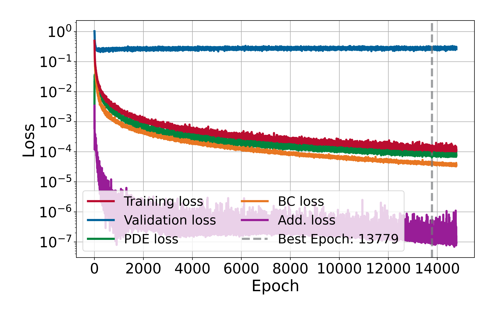
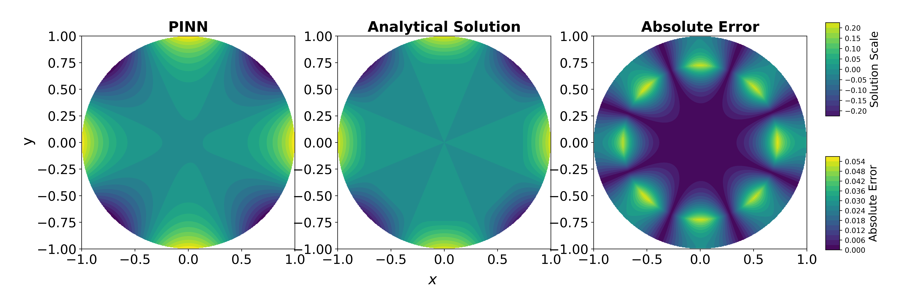
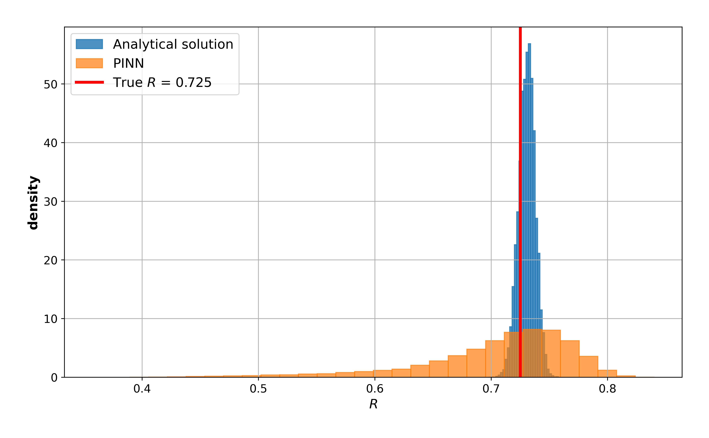

# Conductivity Equation in the Unit Disk

This experiment developes a Physics-Informed Neural Network (PINN) to approximate the solution of a conductivity problem in the unit disk $\Omega= \{ \mathbf{x}\in \mathbb{R}^2 : \|\mathbf{x}\| < 1\}$ where the conductivity depends on two parameters: fixed $\rho$ (**conductivity value**) and a variable $R$ (**conductivity support**). The problem is subject to a Neumann boundary condition and an additional condition given by a Fourier restriction. The study illustrates how a PINN can be extended to a parametric formulation, enabling the model to learn solutions across a range of admissible values of the conductivity support parameter $R$, which is then evaluated for selected test cases.

## Problem Description

The following PDE is solved:

$$
  \nabla \cdot \left( \lambda(\mathbf{x};\theta) \nabla \boldsymbol{u} (\mathbf{x};\theta) \right) = 0, \qquad \mathbf{x}=(x,y)\in \Omega,
$$

subject to the Neumann boundary condition:

$$
  \lambda(\mathbf{x};\theta) \frac{\partial \boldsymbol{u}}{\partial \mathbf{n}} (\mathbf{x};\theta) = g(\mathbf{x}), \qquad \mathbf{x}\in \partial \Omega.
$$

where $\mathbf{n}$ denotes the outward unit normal vector to $\partial \Omega$. The conductivity is piecewise defined as:

$$
\lambda(\mathbf{x};\theta) =
\begin{cases}
    1 + \rho, & \|\mathbf{x}\| < R, \\\\
    1, & R < \|\mathbf{x}\| < 1.
\end{cases}
$$

The analytical solution in for $g = \cos(\varphi)$ in polar coodinates is:

$$
\boldsymbol{u}(r,\varphi) = \begin{cases}
		2 (b + c) \left( \dfrac{r}{R} \right)^4 \cos(4\varphi), & r < R, \\
		2 \left[ b \left( \dfrac{r}{R} \right)^4 + c \left( \dfrac{r}{R} \right)^{-4} \right] \cos(4\varphi), & r > R,
	\end{cases}
$$

where

$$
b = \frac{(\rho+2)R^4}{8(\rho R^8 + \rho + 2)}, \quad c = \frac{\rho R^4}{8(\rho R^8 + \rho + 2)}.
$$

The additional condition is $\int_{\partial \Omega} \boldsymbol{u} ds = 0$ that means:

$$
  \left( \frac{1}{N_{b}} \sum_{i=1}^{N_{b}} \boldsymbol{u}(\mathbf{x}_i;\theta) \right)^{2}.
$$

## Model Summary for $R\in[0,1.0],\ \rho=6$

| Component    | Choice                                                             |
|--------------|--------------------------------------------------------------------|
| Network      | MLP with 4 hidden layers: [100, 1000, 100, 100]                    |
| Optimizer    | L-BFGS (strong Wolfe line search)                                  |
| Activation   | tanh (with LayerNorm after each Linear)                            |
| Dropout      | 1e-04                                                              |
| Domain       | $r\in [0,1],\ \theta\in [0,2\pi]$                                  |
| Collocation  | 1000 interior; 1700 boundary; 3000 additional                      |
| Loss         | PDE residual + boundary condition loss + additional condition loss |
| Weights used | $\lambda_{pde} = \lambda_{bc} = \lambda_{add} = 1.0$               | 
| Error        | $1.01\times10^{-4}$ @ epoch 13779                                  |
| Time         | 37576.27 s                                                         |

### Training Losses

  

### Solution Predicted by the PINN for $R = 0.725$

  

### Comparison with Analytical Solution

  

## Bayesian Inference (MCMC) for $R = 0.725$

| Metric                   | PINN                   | Analytical Solution    |
|--------------------------|------------------------|------------------------|
| **Mean**                 | `0.705305`             | `0.730586`             |
| **Median**               | `0.719902`             | `0.730809`             |
| **Mode**                 | `0.747686`             | `0.744333`             |
| **Std**                  | `0.065876`             | `0.007076`             |
| **Conf. Interval (95%)** | `[0.522833, 0.790964]` | `[0.716325, 0.744097]` |
| **16th Percentile**      | `0.650260`             | `0.723488`             |
| **84th Percentile**      | `0.762443`             | `0.737470`             |
| **Execution time**       | `43.34 s`              | `18.62 s`              |

### Posterior Comparison

  

---

*Author: Ezau Faridh Torres Torres · CIMAT · Aug 2025*