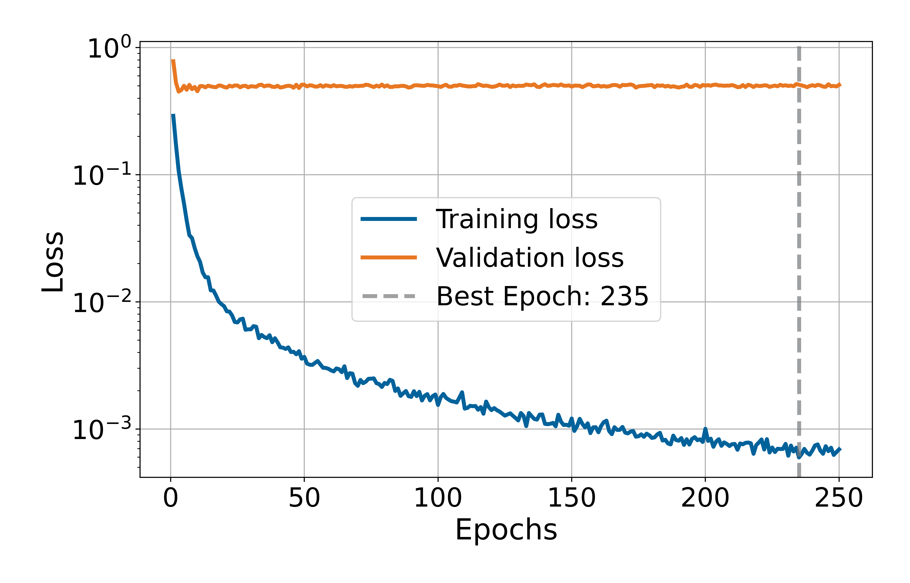
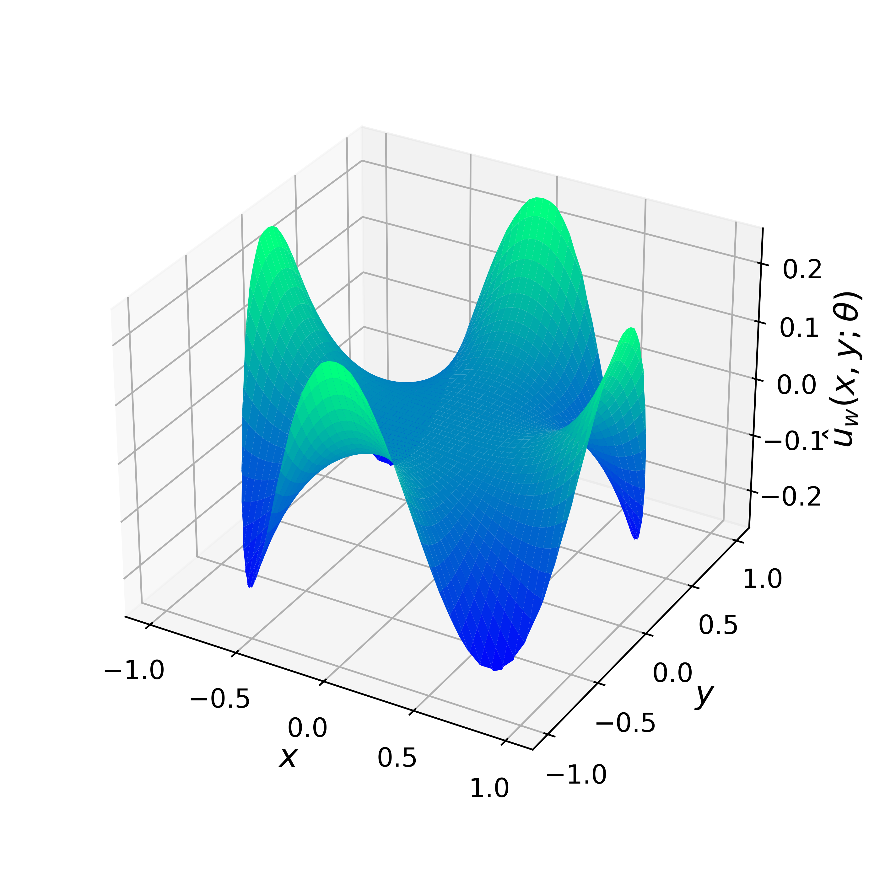

# Inverse Diffusion on Unit Disk

This experiment solves an **inverse problem** for the steady-state diffusion equation on the unit disk Ω = {(x,y) ∈ ℝ² : ‖(x,y)‖ < 1}, using a Physics-Informed Neural Network (PINN).

## Problem Description

We aim to **infer the unknown parameter** ρ from the following PDE with discontinuous diffusion coefficient:

&nbsp; &nbsp; &nbsp; &nbsp; &nbsp; &nbsp; &nbsp; &nbsp; Δ(λ(r) ∇u(x,y)) = 0,

where the coefficient λ(r) is defined piecewise as:

&nbsp; &nbsp; &nbsp; &nbsp; &nbsp; &nbsp; &nbsp; &nbsp; λ(r) = {1 + ρ if r < R, 1 otherwise}

with r = √(x² + y²) and fixed interface R = 0.85.

The analytical solution is given by:

&nbsp; &nbsp; &nbsp; &nbsp; &nbsp; &nbsp; &nbsp; &nbsp; u(x,y) = {2(b + c) · (r / R)^4 · cos(4θ) if r < R,  
&nbsp; &nbsp; &nbsp; &nbsp; &nbsp; &nbsp; &nbsp; &nbsp;  2[b · (r / R)^4 + c · (r / R)^–4] · cos(4θ) if r ≥ R}

---

## Model Summary

- Neural network: MLP with hidden layers [100, 1000, 100, 100].
- Input: (x, y, R, ρ)
- Optimizer: L-BFGS with strong Wolfe line search.
- Domain: unit disk of radius 1 centered at the origin.
- Collocation points:
  - Interior: 1700
  - Boundary: 2000
  - Auxiliary (center): 1200
- Loss components:
  - PDE residual
  - Boundary condition: λ · ∂u/∂n = cos(4θ)
  - Additional condition: u(0, 0) = 0

---

## Training Losses

  

## Solution Predicted by the PINN

  

## Comparison with Analytical Solution

  

---

*Author: Ezau Faridh Torres Torres · CIMAT · Aug 2025*