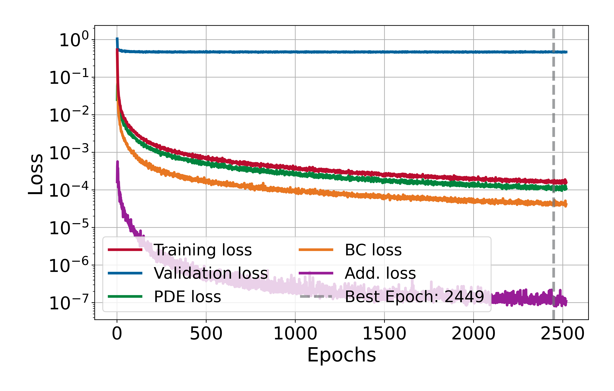
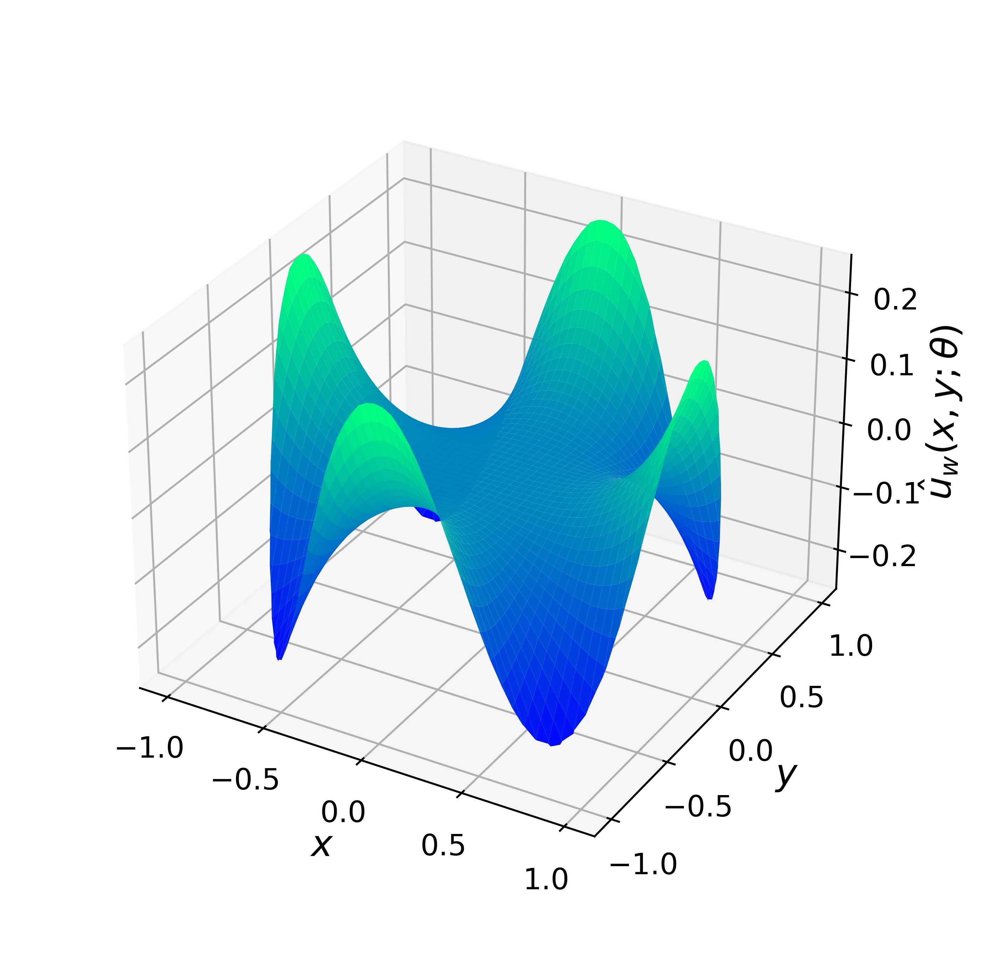
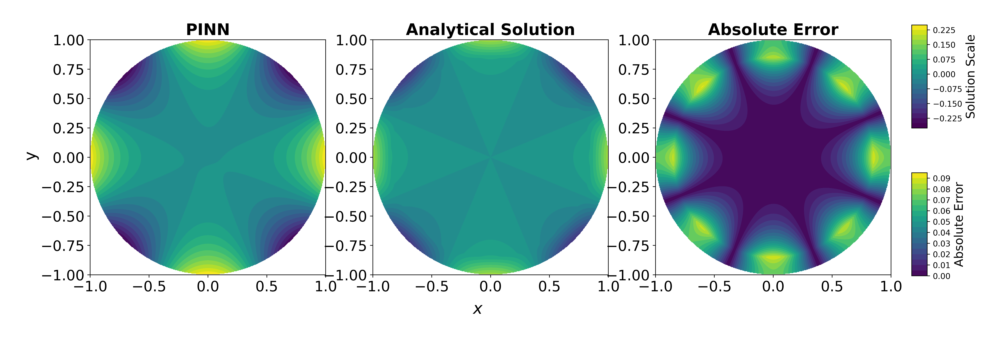
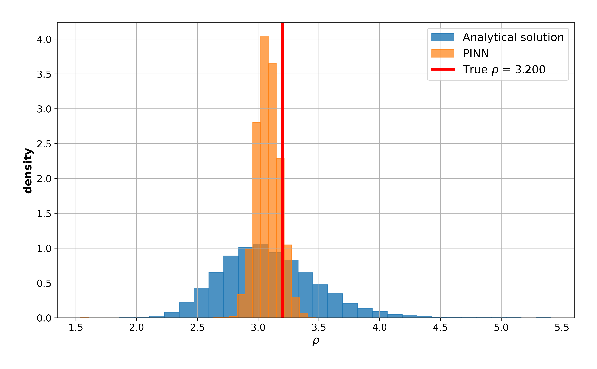

# Conductivity Equation in the Unit Disk

This experiment developes a Physics-Informed Neural Network (PINN) to approximate the solution of a conductivity problem in the unit disk $B$ where the conductivity depends on two parameters: fixed $R$ (**conductivity support**) and a variable $\rho$ (**conductivity value**). The problem is subject to a Neumann boundary condition and an additional condition given by a Fourier restriction. The study illustrates how a PINN can be extended to a parametric formulation, enabling the model to learn solutions across a range of admissible values of the conductivity value parameter $\rho$, which is then evaluated for selected test cases.

## Problem Description

The following PDE is solved:

$$
  \nabla \cdot \left( \lambda(\mathbf{x}) \nabla \boldsymbol{u} (\mathbf{x}) \right) = 0, \qquad \mathbf{x}\in B,
$$

subject to the Neumann boundary condition:

$$
  \lambda \frac{\partial \boldsymbol{u}}{\partial n} (\mathbf{x}) = f(\mathbf{x}), \qquad \mathbf{x}\in \partial B.
$$

where $n$ denotes the outward unit normal vector to $\partial B$. The conductivity is piecewise defined as:

$$
\lambda(\mathbf{x}) =
\begin{cases}
    1 + \rho, & |\mathbf{x}| < R, \\\\
    1, & R < |\mathbf{x}| < 1.
\end{cases}
$$

The analytical solution in for $f = \cos(\theta)$ in polar coodinates is:

$$
\boldsymbol{u}(r,\theta) = \begin{cases}
		2 (b + c) \left( \dfrac{r}{R} \right)^4 \cos(4\theta), & r < R, \\
		2 \left[ b \left( \dfrac{r}{R} \right)^4 + c \left( \dfrac{r}{R} \right)^{-4} \right] \cos(4\theta), & r > R,
	\end{cases}
$$

where

$$
b = \frac{(\rho+2)R^4}{8(\rho R^8 + \rho + 2)}, \quad c = \frac{\rho R^4}{8(\rho R^8 + \rho + 2)}.
$$

The additional condition is $\int_{\partial B} \boldsymbol{u} ds = 0$ that means:

$$
  \left( \frac{1}{N_{b}} \sum_{i=1}^{N_{b}} \boldsymbol{u}(\mathbf{x}_i) \right)^{2}.
$$

## Model Summary for $\rho\in[0,10],\ R=0.85$

| Component    | Choice                                                                |
|--------------|-----------------------------------------------------------------------|
| Network      | MLP with 10 hidden layers of 50 neurons                               |
| Optimizer    | L-BFGS (strong Wolfe line search)                                     |
| Activation   | tanh (with LayerNorm after each Linear)                               |
| Dropout      | 1e-04                                                                 |
| Domain       | $r\in [0,1],\ \theta\in [0,2\pi]$                                     |
| Collocation  | 2700 interior; 3000 boundary; 3000 additional                         |
| Loss         | PDE residual + boundary condition loss + additional condition loss    |
| Weights used | $\lambda_{pde} = 1.0$, $\lambda_{bc} = 1.2$ and $\lambda_{add} = 1.5$ | 
| Error        | $1.48\times10^{-4}$ @ epoch 2449                                      |
| Time         | 14002.94 s                                                            |

### Training Losses

  

### Solution Predicted by the PINN for $\rho = 3.2$

  

### Comparison with Analytical Solution

  

## Bayesian Inference (MCMC) for $\rho = 3.2$

| Metric                   | PINN                   | Analytical Solution    |
|--------------------------|------------------------|------------------------|
| **Mean**                 | `3.079807`             | `3.084516`             |
| **Median**               | `3.077648`             | `3.050642`             |
| **Mode**                 | `3.105181`             | `2.682897`             |
| **Std**                  | `0.100574`             | `0.395636`             |
| **Conf. Interval (95%)** | `[2.891953, 3.271717]` | `[2.409810, 3.955505]` |
| **16th Percentile**      | `2.984501`             | `2.699243`             |
| **84th Percentile**      | `3.180576`             | `3.471416`             |
| **Execution time**       | `78.00 s`              | `89.06 s`              |

### Posterior Comparison

  

---

*Author: Ezau Faridh Torres Torres · CIMAT · Aug 2025*